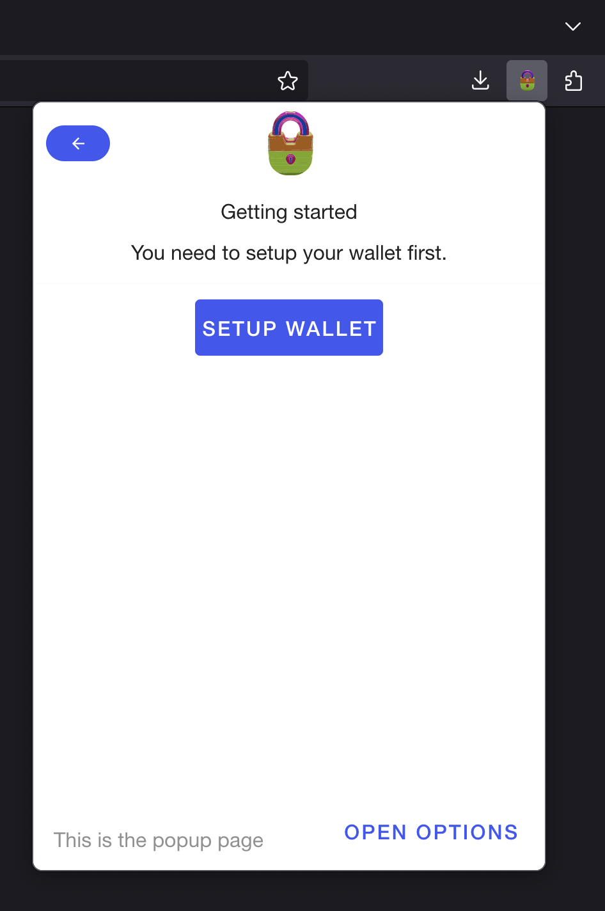
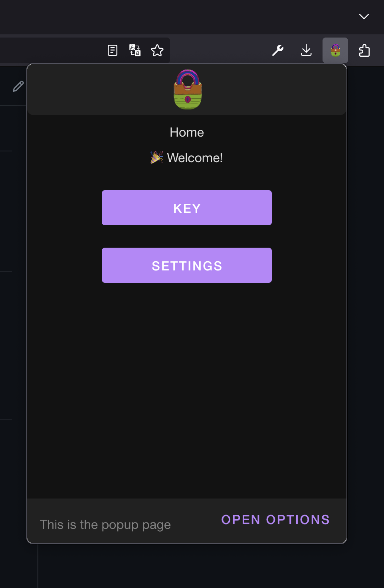
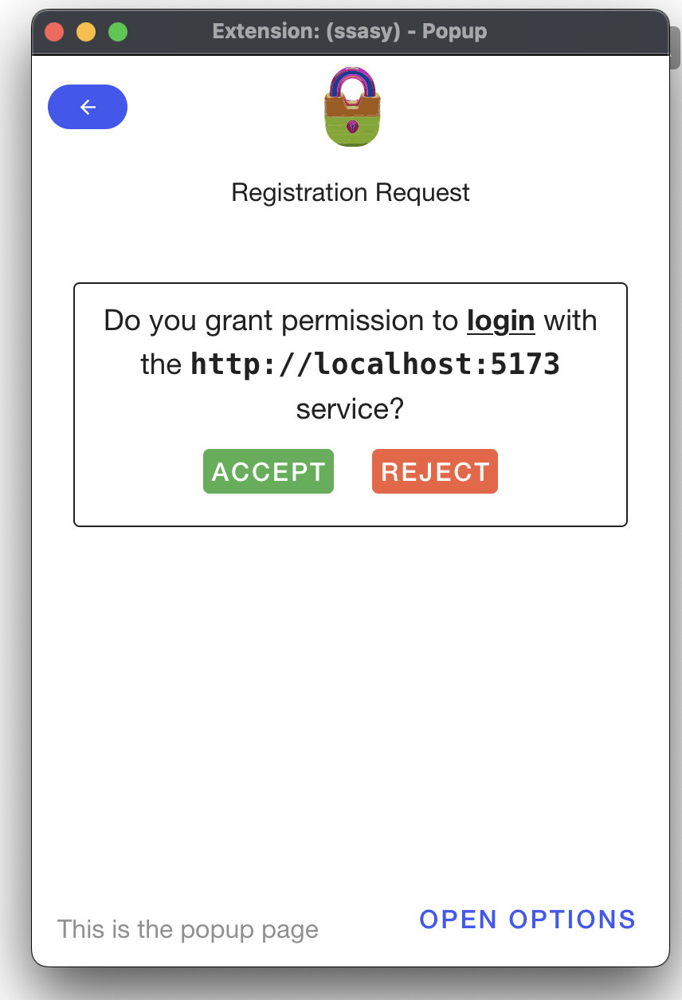

# ssasy ext

  

`ssasy-ext` is a browser extension that offers a secure, usable and scalable alternative to existing password and federation-based user authentication schemes.

The extension is built on top of `ssasy`, a self-sovereign user authentication scheme that leverages public key cryptography to generate, store and retrieve credentials.

To learn more, visit the [ssasy repository](https://github.com/this-oliver/ssasy).

## why does `ssasy-ext` exist?

Nowadays, the average internet user is registered to dozens of websites. Each of these websites requires a password. This means that the average internet user has to remember dozens of passwords.

This is a problem because:

- **strong passwords are hard to remember**. Usually, this means that users choose weak passwords which are easy to remember but easy to guess. Or they re-use one strong password for all their accounts.
- **it only takes one data breach**. If a service that you use gets hacked, your password is potentially leaked. If you use the same password for other services, you are at risk of having your other accounts compromised.

You may be thinking: "I use my Google account to log in to all my other accounts. I don't need to remember any passwords!". This is a good solution but it has a few problems:

- **you are not in control of your identity**. Federated Identities, like Google, control your identity. If you want to change your password, you have to go through Google. If you want to delete your account, you have to go through Google. If Google decides to delete your account, you have no say in the matter.
- **you can be locked out of your account**. If you have registered your other accounts with your Google account, you can be locked out of your other accounts if you lose access to your Google account.

With `ssasy`, you no longer have to remember dozens of passwords. You also no longer have to trust a third party with your identity. Instead, you can use a single credential to authenticate to all your web services in a secure and user-friendly way thanks to cryptography!

## features

- **Secure**. Your credentials never leave your device thanks to public key cryptography.
- **Practical**. One password for all your accounts means you no longer need to remember dozens of passwords.
- **Easy to use**. The extension is designed to be as easy to use as possible. Setup your password in less than 2 minutes.

  

  

  

## documentation

To learn more about the extension, check out the [documentation](docs/index.md).

## design decisions: why does the published package only contain the `bridge` component?

The `bridge` component defines the interface for messages that can be sent and received between the extension and web applications. It also defines the logic for sending and receiving messages. Since the component is dictaed by the extension, it makes no sense to define the component as a stand-alone package.

At the same time, there is no use publishing the extension as a package since it is not intended to be used as a dependency. Instead, the extension is intended to be installed as a browser extension.

In order to keep things simple, the `bridge` component is the only exposed component of the `ssasy-ext` package. In doing so, the `bridge` component can be used as a dependency in other projects without having to install the entire extension along with it's dependencies.

To learn more about the `bridge` component, check out the [bridge documentation](./src/bridge/README.md).
